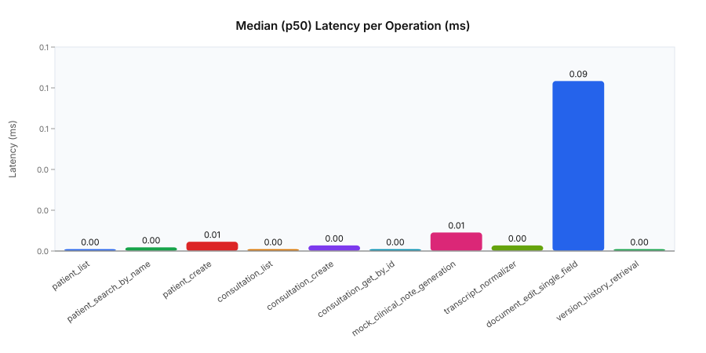
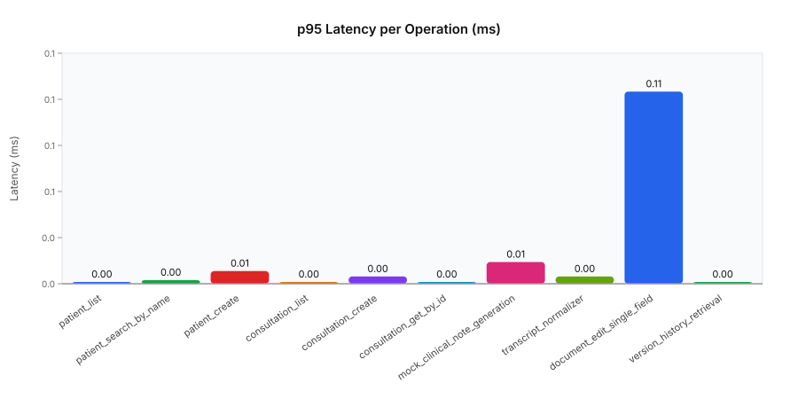
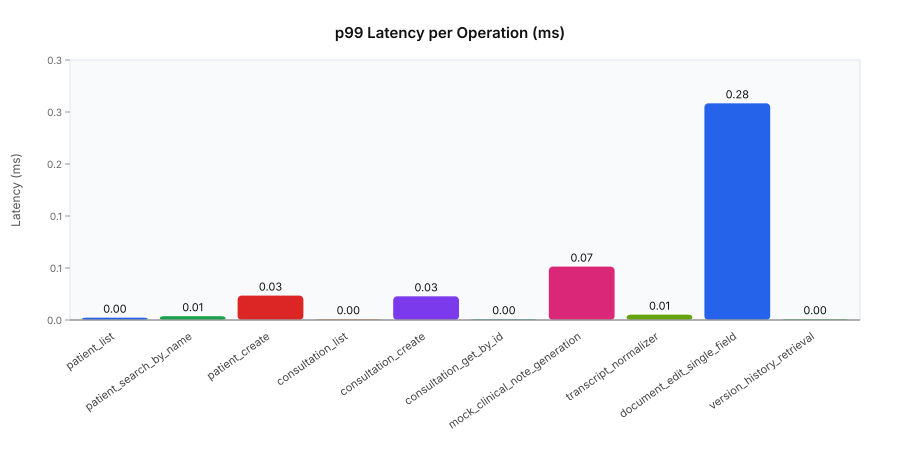

# Missing_Manish

> **OPD-Vertex** — a local-first outpatient clinic platform with LLM-assisted clinical notes.

---

## What I built

OPD-Vertex is a FastAPI web app for outpatient clinics.  
Doctors record consultations, a local Qwen3:8b LLM (via Ollama) transcribes and generates structured clinical notes, a suggestive-mode engine flags contraindications, and a doctor can approve or reject the draft — which creates a versioned prescription.

The stack: **FastAPI + Jinja2** (web), **SQLAlchemy + MySQL** (structured data), **MongoDB** (AI documents), **Faster-Whisper** (transcription), **Ollama/Qwen3:8b** (LLM).  
Everything runs locally, no cloud calls.

---

## What was added in this session

| Area | What changed |
|---|---|
| **Document versioning** | `GeneratedDocument` now has `version` + `version_history` fields; new `DocumentEditingService` lets doctors apply field-level edits, auto-snapshots previous state, and supports restore + diff |
| **AOP logging** | Added `@log_performance(threshold_ms)` decorator — emits `[SLOW]` warnings when an operation exceeds its SLA budget |
| **LLM hallucination tests** | 16 new tests in `test_llm_hallucination.py` verifying field integrity, cross-consultation isolation, contraindication faithfulness, normalisation, and injection guards |
| **Document versioning tests** | 16 new tests in `test_document_versioning.py` covering apply, history, restore, and diff |
| **Benchmarks** | 10 timed tests (p50/p95/p99) across all hot paths — all under their latency budgets |
| **Stress tests** | 20 tests: 1 000 patient creates, 500 concurrent consultation writes, 200 sequential report generations, 50 end-to-end pipeline runs |
| **Graph generation** | `scripts/generate_test_graphs.py` runs the benchmarks, saves `reports/benchmark_results.json`, and emits three SVG charts + a self-contained HTML report |

---

## How to run

```bash
# Run every test (requires Python 3.12, all deps installed)
python -m pytest app/tests/ -v

# Run just benchmarks
python -m pytest app/tests/benchmarks/ -v

# Run stress tests
python -m pytest app/tests/stress/ -v

# Generate benchmark charts → reports/
python scripts/generate_test_graphs.py
```

---

## Test suite at a glance

```
196 tests   0 failures   7 deprecation-only warnings
```

| Suite | Tests |
|---|---|
| smoke | 6 |
| integration | 13 |
| unit (domain, services, repos, logging, security, LLM, versioning, hallucination) | 147 |
| benchmarks | 10 |
| stress | 20 |

---

## Benchmark results (mock adapters, Python 3.12)

All operations run in-memory (no DB/LLM calls), so these are pure application-logic costs.

| Operation | p50 (ms) | p95 (ms) | p99 (ms) |
|---|---|---|---|
| patient list | 0.001 | 0.001 | 0.003 |
| patient search | 0.002 | 0.002 | 0.005 |
| patient create | 0.005 | 0.007 | 0.032 |
| consultation list | 0.001 | 0.001 | 0.001 |
| consultation create | 0.003 | 0.004 | 0.031 |
| consultation get by ID | 0.001 | 0.001 | 0.001 |
| mock clinical note generation | 0.010 | 0.012 | 0.070 |
| transcript normaliser | 0.003 | 0.004 | 0.007 |
| document edit (single field) | 0.092 | 0.106 | 0.284 |
| version history retrieval | 0.001 | 0.001 | 0.001 |

Charts are in [`reports/benchmark_report.html`](reports/benchmark_report.html) and individual SVGs in `reports/`.


> **p50 (median) latency** — the cost of each operation under typical load. Everything sits at or below 0.092 ms, showing the application layer adds almost no overhead in the happy path.


> **p95 latency** — 95% of calls finish within these times. Document editing is the heaviest at 0.106 ms because it deep-copies a Pydantic model to snapshot the previous version before saving the change.


> **p99 (tail) latency** — the worst 1% of calls. The occasional spikes on patient/consultation creates (≈ 0.031 ms) are first-call JIT costs; document editing peaks at 0.284 ms, still well under its 5 ms SLA budget.

---

## Key architectural decisions

- **Ports & Adapters** — every external concern (DB, LLM, email) is behind an abstract repository or service port. Tests swap in in-memory mocks without changing app logic.
- **AOP logging** — `apply_logging_aspect` wraps every public method on a service class at decoration time, keeping business logic free of logging boilerplate.
- **Document versioning** — edits never overwrite; each change creates an immutable snapshot so the full audit trail is always recoverable.
- **Hallucination guard** — mock and real LLM adapters are tested to ensure outputs stay within their structural contracts and do not leak data across consultations.

---

*Run `python -m pytest app/tests/ -q` to verify everything is green.*
